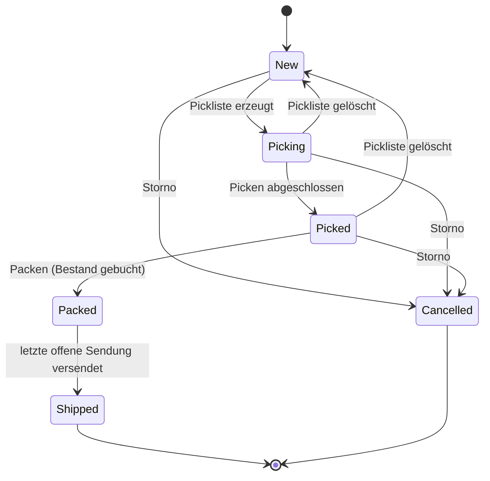
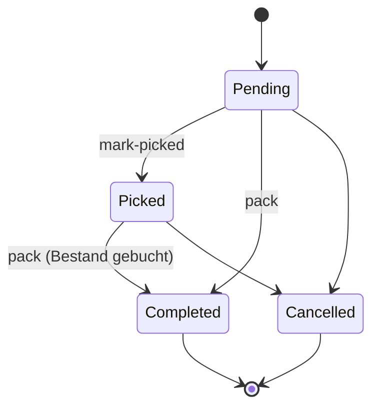
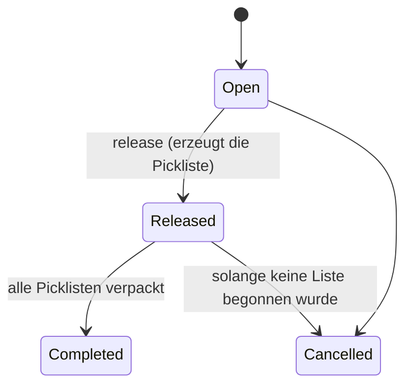

# Architektur

Entwickler-Doku für **Lager**. Wer das System erweitern, debuggen oder selbst betreiben will, fängt hier an. End-User-Workflows stehen in [USAGE.md](USAGE.md), Setup in [GETTING_STARTED.md](GETTING_STARTED.md), Konfigurationsschlüssel in [CONFIGURATION.md](CONFIGURATION.md), die API in [API.md](API.md), die Tabellen in [DATA_MODEL.md](DATA_MODEL.md).

---

## Inhalt

1. [Tech-Stack](#tech-stack)
2. [Clean Architecture — Schichten](#clean-architecture--schichten)
3. [Dependency-Regeln](#dependency-regeln)
4. [Schlüssel-Abstraktionen](#schlüssel-abstraktionen)
5. [Persistence](#persistence)
6. [Auth & Authorization](#auth--authorization)
7. [Fehlerbehandlung](#fehlerbehandlung)
8. [Audit-Trail & StockMovement-Ledger](#audit-trail--stockmovement-ledger)
9. [CSV-Import und -Export](#csv-import-und--export)
10. [Backup und Restore](#backup-und-restore)
11. [Demo-Modus (Seeding)](#demo-modus-seeding)
12. [Lebenszyklen](#lebenszyklen)
13. [Algorithmen und Grenzen](#algorithmen-und-grenzen)
14. [Konfiguration](#konfiguration)
15. [Frontend-Aufbau](#frontend-aufbau)
16. [Eine neue Domain-Entität end-to-end bauen](#eine-neue-domain-entität-end-to-end-bauen)
17. [Schema-Evolution](#schema-evolution)
18. [Logging & Korrelation](#logging--korrelation)
19. [Tests & Build-Verifikation](#tests--build-verifikation)
20. [Betrieb im Container](#betrieb-im-container)

---

## Tech-Stack

**Backend**
- .NET 8, ASP.NET Core 8 (Controller-basiert)
- EF Core 8 mit Provider-Switch SQLite ↔ MySQL (Pomelo)
- FluentValidation für Request-DTOs
- JWT-Bearer-Authentifizierung (`Microsoft.AspNetCore.Authentication.JwtBearer`), Rate-Limiting und Forwarded-Header-Behandlung aus ASP.NET Core
- BCrypt.Net-Next für Passwort-Hashing (Work-Factor 12)
- Serilog (Konsole + Datei, täglich rotierend; Verzeichnis, Aufbewahrung und Level über die Konfiguration)
- ASP.NET-Core-Health-Checks (`/health/live`, `/health/ready`), Antwortkomprimierung
- Ein `BackgroundService` für das zeitgesteuerte Backup (`BackupHostedService`, Uhr über `TimeProvider`)
- Eigene CSV-Verarbeitung (Leser und Schreiber nach RFC 4180, Excel-tauglich) und ein eigener Code-128-Encoder, beide ohne Fremdpaket
- QuestPDF für den Lieferschein (Community-Lizenz, siehe [README](../README.md#drittlizenzen))
- Swashbuckle (Swagger/OpenAPI): läuft in der Umgebung `Development` oder mit `Swagger:Enabled=true` (`Swagger:Enabled=false` schaltet es auch dort ab); die XML-Kommentare von `Lager.Api` und `Lager.Contracts` kommen ins Dokument, siehe [features/openapi.md](features/openapi.md)

**Frontend**
- React 19 + TypeScript, Vite 8
- Konva / react-konva (2D-Canvas für Lager-Layout und Pickroute)
- TanStack Query (Server-State), Zustand (Client-State: Auth, Theme, aktives Lager, Toasts)
- React Router 7
- react-i18next (Deutsch und Englisch, Texte in `frontend/lager-ui/src/locales`), siehe [Sprache](#sprache)
- Axios (HTTP-Client mit Interceptor für JWT, 401- und 403-Behandlung)
- Vitest + Testing Library (jsdom) für Tests, ESLint 10

---

## Clean Architecture — Schichten

```
┌──────────────────────────────────────────────────┐
│  Lager.Api                                       │  Controller, Middleware,
│  (Composition Root)                              │  Program.cs, Validierung,
│                                                  │  Fehlerbehandlung, Seeder
├──────────────────────────────────────────────────┤
│  Lager.Infrastructure                            │  EF Core, Repositories,
│  (Frameworks, IO, externe Adapter)               │  Auth-Implementierungen,
│                                                  │  Carrier, Schema-Schritte
├──────────────────────────────────────────────────┤
│  Lager.Application                               │  Use-Cases als Services,
│  (Anwendungslogik, ohne Frameworks)              │  Abstractions/-Interfaces,
│                                                  │  Pickroute-/Pack-Optimierer
├──────────────────────────────────────────────────┤
│  Lager.Domain                                    │  Entitäten, Value Objects,
│  (Reine Domänen-Sprache, framework-frei)         │  Aggregat-Regeln, Enums
└──────────────────────────────────────────────────┘

Lager.Contracts: DTOs (Plain-Records) für API und Anwendungsschicht. Das Frontend
                 spiegelt sie von Hand in frontend/lager-ui/src/api/types.ts.
```

### Verantwortlichkeiten

| Schicht | Was kommt rein | Was bleibt draußen |
|---|---|---|
| **Domain** | Entitäten (`Article`, `Order`, `PickList`, ...), Enums, Value Objects, Geometrie-Helfer, Aggregat-Invarianten und Statusübergänge in Konstruktoren und Methoden | EF Core, ASP.NET, HTTP, Dateisystem |
| **Application** | Use-Case-Services (`OrderService`, `PickListService`, ...), Optimierer (`WallAwarePickRouteOptimizer`, `FirstFitDecreasingPackingOptimizer`), Abstraktions-Interfaces (`IUnitOfWork`, `ICurrentUser`, `ICarrierAdapter`, Repository-Interfaces ...), `StockBooking` (einheitlicher Buchungsweg), CSV-Import und -Export (`ImportExport/`) | EF Core, `HttpContext`, konkrete Datenbanken, IO |
| **Infrastructure** | `LagerDbContext`, EF-Konfigurationen, Repository-Implementierungen, `SchemaUpgrader` samt Schritten, `JwtTokenService`, `BCryptPasswordHasher`, `HttpContextCurrentUser`, Carrier-Adapter, `ReportQueryGateway`, Backup (`Backup/`: `BackupService`, `BackupHostedService`) | UI, HTTP-Routing |
| **Contracts** | DTOs für API-Ein- und -Ausgabe | Logik, Validierung |
| **Api** | Controller, FluentValidation-Validatoren, Fehlerbehandlung (`Errors/`), Sicherheit (`Security/`), Middleware, Health-Checks (`Health/`), `Program.cs`, `appsettings*.json`, Demo-Seeder (`Seeding/`), PDF-, ZPL- und Code-128-Renderer (`Documents/`, `Labels/`), die EF-Adapter der Import-/Export-Schnittstellen | Geschäftslogik (delegiert an Services) |

---

## Dependency-Regeln

Die einzige erlaubte Richtung ist **nach innen**. Tatsächliche Projektverweise:

```
Lager.Api            ──▶ Application, Infrastructure, Contracts
Lager.Infrastructure ──▶ Application, Domain   (Contracts kommt über Application)
Lager.Application    ──▶ Domain, Contracts
Lager.Contracts      ──▶ (nichts)
Lager.Domain         ──▶ (nichts)
```

- `Lager.Domain` hat **keine** Projekt- und keine Paketverweise.
- `Lager.Application` kennt weder EF Core noch ASP.NET; als einziges Paket nutzt sie die DI-Abstractions.
- `Lager.Infrastructure` implementiert die in Application definierten Interfaces.
- `Lager.Api` ist der Composition Root und verdrahtet alles in `Program.cs` (`AddApplication()`, `AddInfrastructure()`, `AddLagerSecurity()`).

**Faustregel:** Muss ein Service in Application etwas tun, das Datenbank, Hardware oder HTTP berührt, definiert er ein Interface in `Application/Abstractions/` (oder neben dem Service). Die Implementierung liegt in Infrastructure.

---

## Schlüssel-Abstraktionen

Die meisten Interfaces liegen in `src/Lager.Application/Abstractions/`; einzelne wohnen bei ihrem Service (`IPickRouteOptimizer` in `PickLists/`, `IPackingOptimizer` in `Packing/`, `IReportQueryGateway` in `Reports/`).

| Interface | Wofür | Implementierung |
|---|---|---|
| `IRepository<T>` und die aggregat-spezifischen Repositories (`IArticleRepository`, `IOrderRepository`, `IStockRepository`, `IPickListRepository`, ...) | Zugriff auf Aggregate | EF-basiert in `Infrastructure/Persistence/Repositories/` |
| `IUnitOfWork` | `SaveChangesAsync()` | `EfUnitOfWork` |
| `ICurrentUser` | angemeldeter Benutzer für Audit-Stempel und Regeln | `HttpContextCurrentUser` (liest die Claims des Requests; außerhalb eines Requests "System") |
| `ISecurityAudit` | Sicherheitsereignisse ins Log | `SecurityAuditLogger` |
| `IPasswordHasher` | Hash und Prüfung | `BCryptPasswordHasher` |
| `IJwtTokenService` | Token ausstellen (`IssueToken`); geprüft werden Tokens von der JWT-Middleware | `JwtTokenService` (HMAC-SHA256) |
| `IPickRouteOptimizer` | Pickroute berechnen | `WallAwarePickRouteOptimizer` |
| `IPackingOptimizer` | Karton-Packvorschlag | `FirstFitDecreasingPackingOptimizer` |
| `IReportQueryGateway` | schmale Lese-Schnittstelle für Auswertungen | `ReportQueryGateway` (EF-Core-Projektionen mit `AsNoTracking`) |
| `IStockMovementRepository` | Ledger (nur Anhängen); Lesen über das Gateway | `StockMovementRepository` |
| `IAuditBatch` | Sammelmodus des Audits für Importe: ein Sammel-Eintrag statt einer Zeile je Entität | `AuditBatch` (scoped), ausgewertet vom `AuditingInterceptor` |
| `IImportTransactionFactory` / `IExportSource` | Datenbank-Transaktion um eine Import-Übernahme bzw. gestreamte Zeilen für den Export, damit die Anwendungsschicht kein EF Core kennt | `EfImportTransactionFactory`, `EfExportSource` (`Controllers/ImportExportController.cs`) |
| `ICarrierAdapter` / `ICarrierRegistry` | Versanddienstleister | `ManualCarrierAdapter` (aktiv), `DhlStubAdapter` und `UpsStubAdapter` (nicht angebunden) |
| `IExternalOrderSource` | Anbindung ERP/Shop | **nicht verdrahtet**, siehe unten |
| `IScaleReader` | Pack-Waage | `NullScaleReader` (liefert nie einen Wert) |

### Erweiterungspunkte — was heute wirklich funktioniert

**Carrier (Versand).** Einen echten Carrier anzubinden bedeutet:
1. Klasse implementiert `ICarrierAdapter` (Eigenschaften `CarrierCode`, `DisplayName`, `IsConfigured`, `UnavailableReason`; Methode `CreateLabelAsync`).
2. In `Infrastructure/DependencyInjection.cs` mit `services.AddSingleton<ICarrierAdapter, MeinAdapter>()` registrieren; die `CarrierRegistry` sammelt alle Adapter.
3. Nur Carrier mit `IsConfigured == true` lassen sich für neue Sendungen wählen. Beim Zuweisen des Trackings (`ShipmentService.AssignTrackingAsync`) ruft der Service `CreateLabelAsync` des konfigurierten Adapters auf und übernimmt Tracking-Nr, URL und Kosten; meldet der Adapter `IsManual`, gilt die manuelle Eingabe. `DhlStubAdapter` und `UpsStubAdapter` sind **Platzhalter**: sie stehen in der Registry, sind nicht konfiguriert und erzeugen nie eine Fake-Tracking-Nummer.

**Externe Bestellquellen (`IExternalOrderSource`).** Es gibt nur das Interface und eine `ExternalOrderSourceRegistry` in der Dependency-Injection; **nichts liest sie aus**. Ein neuer Connector hat heute keine Wirkung. Für einen Import müsste ein Hintergrunddienst die Quellen abfragen und über `OrderService.CreateOrGetAsync` anlegen (idempotent über `ExternalReference`). Fertig nutzbar ist dagegen die **externe Bestell-API** `POST /api/orders` (Idempotency-Key, siehe [API.md](API.md#bestellungen-und-kunden)).

**Waage (`IScaleReader`).** Die Endpunkte `GET /api/hardware/scale/status` und `.../read` existieren, liefern aber mit dem `NullScaleReader` nie einen Messwert (`read` antwortet 204); die Oberfläche ruft sie nicht auf.

**Etiketten.** Der ZPL-Generator (`Labels/ZplLabelRenderer`) liefert Downloads über `GET /api/labels/...zpl` (`?copies=n`). Die Oberfläche druckt dieselben Etiketten auch im Browser (Seite `/labels`, Code 128 als Inline-SVG) und lädt das ZPL mit dem Token; der Code-128-Encoder existiert zweimal mit denselben Regeln und Testvektoren (`Labels/Code128Encoder.cs` für das Lieferschein-PDF, `frontend/lager-ui/src/features/labels/code128.ts` für die Vorschau). Netzwerkdruck direkt an einen Zebra-Drucker gibt es nicht. Einzelheiten: [features/etiketten.md](features/etiketten.md).

---

## Persistence

### DbContext
`LagerDbContext` in `Lager.Infrastructure/Persistence/`. Alle `DbSet`s sind dort registriert. Konfigurationen liegen pro Entität in `Persistence/Configurations/*.cs` und werden über `ApplyConfigurationsFromAssembly` eingelesen. Zwei Konventionen gelten für das ganze Modell: **alle `DateTime` sind UTC** (Value-Converter, damit JSON ein `Z` trägt) und bei SQLite haben SKU, Bestellnummer und Benutzername die Collation `NOCASE`.

### Provider-Switch
Über die Konfiguration (Details in [CONFIGURATION.md](CONFIGURATION.md#datenbank)):

```jsonc
"Database": {
  "Provider": "Sqlite",                    // oder "MySql"
  "ConnectionString": "Data Source=lager.db",
  "Seed": false                            // veraltet: kleiner Altbestand-Datensatz (true in appsettings.Development.json)
},
"Demo": { "Enabled": false }               // Demo-Modus, siehe unten (Demo-Modus (Seeding))
```

`Infrastructure/DependencyInjection.AddInfrastructure()` schaltet anhand von `Provider` zwischen `UseSqlite` und `UseMySql` um. SQLite läuft im WAL-Modus mit 5 s Wartezeit (PRAGMAs auf jeder Verbindung). Die Datenbank wird beim Start durch `DatabaseInitializer` aufgebaut (siehe [Schema-Evolution](#schema-evolution)).

### Concurrency
`Entity` trägt ein `ConcurrencyToken` (GUID), das `Touch()` bei jeder Änderung wechselt. Erzwungen (`IsConcurrencyToken`) ist es für **StockItem, Order, PickList, PickWave, InboundShipment, InventoryCount, ReturnShipment, PurchaseOrder, Shipment und ReplenishmentTask** (`ConcurrencyTokenConfiguration.cs`). Ein zweiter, gleichzeitiger Schreiber löst eine `DbUpdateConcurrencyException` aus, die der globale Fehler-Handler zu **409 `concurrency_conflict`** macht. Die Oberfläche zeigt die Meldung des Servers an und lädt nicht selbst neu. Stammdaten (Artikel, Kunden, Lagerplätze ...) sind "letzter Schreiber gewinnt".

### Repository-Pattern
Repositories erben von `IRepository<T>` (Get/List/Add/Remove) und ergänzen aggregat-spezifische Abfragen. Beispiel aus dem Code:

```csharp
public interface IOrderRepository : IRepository<Order>
{
    Task<Order?> GetByNumberAsync(string orderNumber, CancellationToken ct = default);
    Task<IReadOnlyList<Order>> GetManyAsync(IEnumerable<Guid> ids, CancellationToken ct = default);
    Task<IReadOnlyList<Order>> ListByStatusAsync(OrderStatus status, CancellationToken ct = default);
}
```

Die Implementierung (`Persistence/Repositories/OrderRepository.cs`) macht das EF-Mapping; Services kennen nur das Interface.

### Unit-of-Work
`SaveChangesAsync()` wird **einmal pro Use-Case** am Ende der Service-Methode aufgerufen, nie im Repository. So bleibt die Transaktionsgrenze im Service: Bestand, Ledger, Beleg und Statuswechsel gehen in **einem** Commit durch (z. B. Packen, Wareneingang buchen, Inventur abgleichen).

### Bestandsbuchung (`StockBooking`)
Jede Änderung einer Bestandsmenge läuft über `Application/Stock/StockBooking.cs`: Bestandszeile **lot-genau** (Artikel, Lagerplatz, Charge) finden oder anlegen, Menge ändern, genau ein `StockMovement` schreiben. Wer `StockItem.Quantity` direkt ändert, umgeht das Ledger und verletzt die Invariante "Summe der Deltas = Bestand". Abgänge über den Bestand hinaus werfen `insufficient_stock` statt still zu kappen.

---

## Auth & Authorization

### Flow
1. `POST /api/auth/login` → `AuthService.LoginAsync` → BCrypt-Prüfung → JWT (HS256) → `{ token, expiresAt, user }`. Jeder Fehlschlag (unbekannter Benutzer, falsches Passwort, gesperrt, deaktiviert) antwortet identisch (401 `invalid_credentials`) und kostet dieselbe Rechenzeit.
2. Das Frontend speichert Token und Benutzer im Zustand-Store (`useAuth`, persistiert unter `lager.auth` im `localStorage`) und hängt das Token als `Authorization: Bearer` an jede Anfrage.
3. Die JWT-Middleware prüft Signatur, Aussteller, Zielgruppe und Ablauf (30 s Toleranz). Anschließend lädt `AuthenticatedUserValidator` den Benutzer bei **jedem Request** aus der Datenbank: unbekannt, deaktiviert, geänderter Passwort-Stempel (Claim `sstamp`) oder geänderte Rollen → 401. So wirken Deaktivierung und Passwortwechsel sofort (Token-Widerruf ohne eigene Tabelle).
4. **Standardmäßig geschlossen:** `Program.cs` setzt eine `FallbackPolicy` (angemeldet **und** kein ausstehender Passwortwechsel) und hängt dieselbe Anforderung per `MapControllers().RequireAuthorization()` an jeden Controller-Endpunkt. Anonym bleibt nur, was ausdrücklich freigegeben ist: `POST /api/auth/login` (`[AllowAnonymous]`), die Health-Endpunkte `/health/live` und `/health/ready` (`MapLagerHealthChecks`, Antwort nur der Status) und, falls ein Frontend in `wwwroot` liegt, dessen Dateien und der SPA-Fallback. Ein neuer Controller ohne Attribut ist also **nicht** offen; auch ein nicht vorhandener Pfad antwortet ohne Token mit 401 statt 404.
5. **Passwortwechsel-Zwang:** Hat der Benutzer `MustChangePassword`, verweigert `PasswordChangeNotPendingHandler` alles außer Endpunkten mit `[AllowPasswordChangePending]` (`GET /api/auth/me`, `POST /api/auth/change-password`) mit 403 `password_change_required`.
6. **Rate-Limiting** (je Client-IP): streng am Login, grob global, 429 mit `Retry-After`.

### Rollen und Policies
Rollen sind ein `[Flags]`-Enum (`Viewer`, `Picker`, `Packer`, `Receiver`, `Manager`, `Admin`), in der Datenbank als Zahl gespeichert und im Token als **ein `role`-Claim je Rolle** (`ClaimTypes.Role`) geführt. Die Policies stehen in `Security/SecurityServiceCollectionExtensions.cs`:

- `Admin` → nur Admin
- `Manager` → Admin + Manager
- `Picker` → Admin + Manager + Picker
- `Packer` → Admin + Manager + Packer
- `Receiver` → Admin + Manager + Receiver
- ohne Policy (`[Authorize]`) → jeder Angemeldete, auch Viewer

Verwendung: Klassenebene `[Authorize]`, schreibende Aktionen zusätzlich `[Authorize(Policy = "Manager")]` usw. (beide Attribute gelten gemeinsam). `AdminController` und `UsersController` tragen `[Authorize(Policy = "Admin")]` auf Klassenebene. Die vollständige Zuordnung steht in [API.md](API.md#endpunkte) und wird durch `tests/Lager.Tests/WP02/EndpointMatrix.cs` gegen die echten Routen geprüft: **ein neuer Endpunkt braucht dort eine Zeile.**

### Bootstrap-Admin
Beim Start mit leerer Tabelle `Users` legt `BootstrapAdminService` einen Admin an (`Auth:BootstrapAdminUsername`, Standard `admin`). Ein **Standardpasswort gibt es nicht**: entweder `Auth:BootstrapAdminPassword` (vom Betreiber gesetzt, wird nie geloggt) oder ein Zufalls-Einmalpasswort, das genau einmal auf der Konsole (stdout) erscheint, nicht in der Logdatei. Beide Wege setzen `MustChangePassword`. Wiederherstellung bei Verlust: [TROUBLESHOOTING.md](TROUBLESHOOTING.md#passwort-verloren-oder-kein-admin-mehr).

### JWT-Key
`JwtKeyResolver` löst den Signing-Key beim Start auf (`Jwt:SigningKey`, sonst `Jwt:KeyFile`, nur `Development`: flüchtiger Zufallskey). Keys unter 32 Bytes und der frühere Beispiel-Key werden in jeder Umgebung abgelehnt; ohne Key startet die API außerhalb von `Development` nicht (Start-Validierung, nicht erst beim ersten Login).

### ICurrentUser
`HttpContextCurrentUser` liest die Claims des Requests:

```
UserId    → Claim "sub" (Guid), sonst ClaimTypes.NameIdentifier
Username  → ClaimTypes.Name
Roles     → alle ClaimTypes.Role-Claims, zu Role-Flags zusammengefasst
```

Außerhalb eines HTTP-Requests (Start, Seeder) meldet `IsSystemContext` `true`. Der Audit-Trail stempelt dann `system`, für Requests ohne Anmeldung `anonymous`.

### Weitere Schutzmaßnahmen
Sicherheits-Header auf jeder Antwort (`SecurityHeadersMiddleware`), Host-Header-Filter (`AllowedHosts`), optional HSTS/HTTPS-Weiterleitung und Forwarded-Header (siehe [CONFIGURATION.md](CONFIGURATION.md#https-reverse-proxy-und-rate-limiting)), Kontosperre nach Fehlversuchen, Schutz des letzten Admins (`UserService`). Sicherheitsereignisse werden als `SecurityAudit`-Logzeilen geschrieben.

---

## Fehlerbehandlung

Alle Fehler verlassen die API im selben Format (RFC 7807 `application/problem+json`, siehe [API.md](API.md#fehlerformat)). Der Vertrag zwischen Domain/Application und HTTP:

- Fachliche Fehler werden als **Exception** geworfen, kein `try/catch` im Controller:
  - `KeyNotFoundException` → 404
  - `ArgumentException` (auch `ArgumentOutOfRangeException`), FluentValidation-`ValidationException` → 400
  - `InvalidOperationException` (Regelverstoß, ungültiger Statuswechsel) → 409
  - `DbUpdateConcurrencyException` → 409 `concurrency_conflict`; Unique-Verletzung → 409 `duplicate`; Fremdschlüssel → 409 `in_use` bzw. `invalid_reference`
  - alles andere → 500 ohne Details
- Ein eigener, maschinenlesbarer Code steht in `exception.Data["code"]` (snake_case) und ersetzt den Standardcode. Beispiele: `Order.Cancel()` wirft `order_not_cancellable`, `StockBooking` wirft `insufficient_stock`.
- Der `GlobalExceptionHandler` (`Errors/`) bildet die Exceptions ab, logt fachliche Fehler ohne Stacktrace und Unerwartetes als Error mit Korrelations-ID. Eine `InvalidOperationException` gilt nur dann als Regelverstoß, wenn eigener Code (`Lager.*`) sie geworfen hat; eine aus dem Framework bleibt ein 500.
- `UseLagerStatusCodePages` füllt leere 401/403/404/405 der Pipeline mit ProblemDetails; bereits geschriebene Bodies bleiben unangetastet.
- Enums im JSON nur als Text; Query-Parameter wie `days`, `range`, `top` haben Obergrenzen (`QueryLimitsFilter`).

Kein Controller fängt Fachfehler noch lokal ab: alle laufen durch den globalen Handler. **Bekannte Abweichungen** im Format: der Login-Fehler hat kein `correlationId` im Body, und die Antworten für 429 (Rate-Limit, `OnRejected`) und 403 `password_change_required` (`PasswordChangeEnforcement`) schreiben ein kurzes `{ code, error }` selbst, weil sie vor dem Handler entstehen; der Host-Filter antwortet mit einer HTML-Seite. Ein neuer Endpunkt braucht keinen eigenen `try/catch`; eine Ausnahme mit Begründung ist die Übersetzung von IO-Fehlern beim Restore (`AdminController`).

---

## Audit-Trail & StockMovement-Ledger

### AuditingInterceptor
EF-`SaveChangesInterceptor` in `Infrastructure/Persistence/AuditingInterceptor.cs`. Vor jedem `SaveChanges`:
1. Snapshot der `ChangeTracker.Entries()`, gefiltert auf die Typen aus `AuditedTypes`.
2. Pro geändertem Eintrag ein `AuditEntry { EntityType, EntityId, Operation, ChangesJson, User }`.
3. `User` kommt aus `ICurrentUser.Username`, `anonymous` für Requests ohne Anmeldung, `system` für Arbeit außerhalb eines Requests (Seeder, Start).

Auditiert werden **Article, StockItem, Order, PickList, Wall, StorageLocation, Warehouse, PickPoint, Shelf, PickCartConfig und User** (Passwort-Hashes maskiert; die Login-Buchhaltung eines Benutzers erzeugt keinen Eintrag). Positionszeilen (`OrderLine`, `PickItem` ...) erscheinen im Diff ihres Besitzers. **Nicht** auditiert sind Kunden, Lieferanten, Einkaufsbestellungen, Wareneingänge, Inventuren, Retouren, Sendungen, Wellen und Nachschub-Aufgaben. Es gibt also **keinen "vollen" Audit-Trail**; Änderungen der Bestandsmengen sind über das Ledger nachvollziehbar (dort ohne Benutzer), Sicherheitsereignisse über das Log.

**Import-Scope:** Schreibt ein CSV-Import, ist der **Sammelmodus** (`IAuditBatch`, scoped je Request) aktiv: der Interceptor schreibt keine Einzelzeilen, zählt die Änderungen je Entitätstyp und hängt mit dem letzten `SaveChanges` **einen** Eintrag an (`EntityType` `CsvImport`, `Operation` `Import`, `EntityId` = Kennung des Imports, `Changes` mit Zusammenfassung und Zählungen). Ein Import von 1000 Artikeln flutet den Trail also nicht; Trockenläufe und Importe ohne Änderung schreiben nichts. Ohne aktiven Sammelmodus verhält sich das Auditing unverändert.

### StockMovement-Ledger
Nur anhängende Tabelle. Jede Bestandsänderung schreibt **einen** Eintrag mit vorzeichenbehaftetem Delta (`+10` Zugang, `-3` Abgang), Kosten-Snapshot, Grund, Vorgangsverweis sowie Charge und MHD der Zeile. Gründe (`StockMovementReason`): `Inbound`, `Pick`, `Return`, `Inventory`, `ReplenishmentOut`, `ReplenishmentIn`, `Adjust`, `BinMove`, `ReturnB`, `ReturnScrap`. Es gibt **keine Reservierung**: der Bestand wird erst beim Verpacken (`Pick`) abgebucht.

Aus dem Ledger werden berechnet: Bestandsbewertung (FIFO), Bestandsverlauf, Charge-Rückverfolgung, Dead-Stock (siehe [DATA_MODEL.md](DATA_MODEL.md#bestand-und-ledger)).

Schreibpfad: **immer** über `StockBooking` (siehe [Persistence](#persistence)). Ein Test (`LedgerInvariantTests`) prüft, dass die Summe der Deltas dem Bestand entspricht.

---

## CSV-Import und -Export

Bedienung und Formate: [USAGE.md](USAGE.md#csv-import-und--export) und [features/csv-import-export.md](features/csv-import-export.md). Aufbau:

- **Anwendungsschicht** (`Lager.Application/ImportExport/`, ohne EF Core): `CsvReader`/`CsvWriter` (RFC 4180, Kodierungserkennung UTF-8/UTF-16/Windows-1252, Formel-Injection-Schutz im Export), `ImportService` mit je einem Handler pro Art (`ArticleImporter`, `StockImporter`, `OrderImporter`, intern über `IImportHandler`) und `CsvExporter`.
- **Host** (`Lager.Api/Controllers/ImportExportController.cs`): die Endpunkte `GET /api/export/*.csv` und `POST /api/import/{articles|stock|orders}` (Rolle Manager) und die EF-Adapter der Schnittstellen `IImportTransactionFactory` (eine Datenbank-Transaktion um die Übernahme) und `IExportSource` (Zeilen als `IAsyncEnumerable`, `AsNoTracking`: nie eine ganze Tabelle im Speicher).
- **Ablauf eines Imports:** Datei lesen und begrenzen (5 MB, 20.000 Zeilen) → jede Zeile gegen die Regeln **und** den Datenstand prüfen, ohne zu schreiben (`PlanAsync`) → beim Trockenlauf (`dryRun`, **Standard**) das Ergebnis liefern; bei der Übernahme dieselbe Prüfung **innerhalb der Transaktion** wiederholen und nur schreiben, was gültig ist. Der Trockenlauf sagt damit voraus, was die Übernahme tut.
- **Geschrieben wird nur über die vorhandenen Dienste** (`ArticleService`, `StockBooking`, `OrderService`): der Import umgeht keine Regel und kein Ledger. Bestand wird nie direkt eingefügt: ein Bestandsimport setzt den **Sollbestand** und bucht die Differenz als `Adjust` mit `ReferenceType` `CsvImport`, die Invariante "Summe der Deltas = Bestand" bleibt erhalten.
- **Audit:** ein Sammel-Eintrag je Import (siehe [Audit-Trail](#audit-trail--stockmovement-ledger), Import-Scope).
- **Neues Importformat:** einen Handler anlegen (Spalten in `CsvColumns`, Prüfung in `PlanAsync`, Schreiben über die Dienste), in `ImportService` einbinden, den Endpunkt samt **Zeile in `tests/Lager.Tests/WP02/EndpointMatrix.cs`** ergänzen und die Spalten im Export spiegeln (ein Export muss sich wieder importieren lassen; ein Test prüft den Kreislauf).

---

## Backup und Restore

Bedienung: [USAGE.md](USAGE.md#backup-und-restore), Regeln und Fehlercodes: [features/backup-restore.md](features/backup-restore.md). Aufbau (alles für **SQLite**; bei MySQL meldet `GET /api/admin/backup-settings` den `mysqldump`-Aufruf):

- `Lager.Infrastructure/Backup/`: `BackupOptions` (Abschnitt `Backup`: `Directory`, `Schedule`, `RetentionCount`, `AllowRestore`), `BackupService` (Liste, Backup, Aufbewahrung, Löschen, Restore; ein Zugriffsschutz serialisiert die Vorgänge), `BackupSchedule` (Berechnung des nächsten Laufs als reine Funktion) und `BackupHostedService` (Hintergrunddienst, der täglich zur Uhrzeit aus `Backup:Schedule` ein Backup anlegt; UTC, verpasste Läufe werden nicht nachgeholt).
- Die Dateilogik (`VACUUM INTO` für den konsistenten Snapshot, Prüfung und atomarer Austausch beim Restore) bleibt in `Persistence/DatabaseInitializer.cs` (`SqliteDatabaseFile`). Ein Restore prüft die Datei (SQLite-Header, `PRAGMA integrity_check`, Pflichttabellen, Schemastand nicht neuer als die App), legt eine Sicherheitskopie an und tauscht die Datei; **danach ist ein Neustart nötig**, weil sich die Datenbankverbindung zur Laufzeit nicht austauschen lässt.
- Die Endpunkte stehen im `AdminController` (Rolle Admin). Dateinamen werden **nur gegen ein festes Namensmuster** akzeptiert (kein Pfad, nie die Live-Datenbank), Antworten nennen keine Serverpfade.
- Frontend: `frontend/lager-ui/src/features/system/` (Seite, Restore-Dialog, `route.tsx`), Hooks in `frontend/lager-ui/src/api/systemHooks.ts`.

---

## Demo-Modus (Seeding)

Bedienung und Datensatz: [GETTING_STARTED.md](GETTING_STARTED.md#5-demo-modus-und-demo-daten-erkunden) und [features/demo-modus.md](features/demo-modus.md). Aufbau in `Lager.Api/Seeding/`:

- `DemoSettings` liest `Demo:Enabled` (Kurzform: Umgebungsvariable `LAGER_DEMO`) und `Demo:AllowInProduction`; in `Production` bricht der Start ohne Freigabe ab (Prüfung in `Program.cs`, bevor etwas angelegt wird). Der veraltete Schalter `Database:Seed` legt nur den kleinen Altbestand-Datensatz an.
- `DemoCatalog` hält die festen Inhalte (Artikel, Lieferanten, Kunden, Chargen, Benutzer, Lagerlayout), `DemoHistoryGenerator` simuliert rund 60 Tage Betrieb mit **festem Zufallsstartwert** (deterministisch). `DemoDataSeeder.SeedAsync` legt nur in eine **leere** Datenbank und in **einer Transaktion** an.
- Der Bestand entsteht **nur über `StockBooking`**, Belege laufen durch die echten Domain-Methoden und Algorithmen (`StockAllocator`, Wegoptimierer): Ledger und Bestand stimmen überein. Die Domain setzt Zeitstempel immer auf "jetzt"; der Generator ersetzt sie nach jeder Fachaktion über den EF-Property-Zugriff (`Entry(e).Property("CreatedAt").CurrentValue`) durch den simulierten Zeitpunkt, ohne Domain-Setter zu öffnen. Auch der Audit-Trail wird auf Zeit und Akteur umgeschrieben.
- Die zufälligen Passwörter der Demo-Benutzer stehen einmalig als Warnung "Demo-Zugangsdaten" in der **Konsole**; die Eigenschaft `DemoCredentials` hält den Eintrag aus der Logdatei heraus (`LagerLogging`).
- Offen: ein Demo-Reset-Endpunkt und ein Demo-Hinweis in der Oberfläche (siehe [TODO.md](../TODO.md)); `POST /api/admin/reseed` (nur `Development`) legt weiter nur den kleinen Altbestand-Datensatz an.

---

## Lebenszyklen

Die Übergänge sind in den Domain-Klassen erzwungen (`Order.Transition`, `PickList`, `PickWave`, `Shipment` ...); unzulässige Übergänge werfen eine `InvalidOperationException` (409).

**Bestellung**



**Pickliste**



Der Zustand `InProgress` ("Picker zugewiesen", `PickList.Assign`) ist im Domänenmodell vorgesehen, wird aber von keinem Vorgang gesetzt; der Picker wird beim Abschluss des Pickens festgehalten (`AssignedTo`) und speist den Picker-Performance-Report.

**Welle**



Wichtig für das Verständnis: Der Bestand wird **nur beim Packen** gebucht. Deshalb hat ein Storno oder das Löschen einer offenen Pickliste keine Bestandswirkung, und ab `Packed` gibt es für eine Bestellung nur noch die Retoure. Eine Bestellung wird `Shipped`, sobald mindestens eine Sendung raus ist und keine mehr offen (Ready/Labeled) ist. Weitere Automaten (Sendung, Wareneingang, Einkauf, Inventur, Retoure, Nachschub) stehen in [DATA_MODEL.md](DATA_MODEL.md#status-automaten).

---

## Algorithmen und Grenzen

Was die Optimierer tatsächlich tun, und was nicht:

- **Bestandsauswahl beim Kommissionieren** (`StockAllocator`): nur nicht abgelaufene Chargen (MHD vor heute UTC gilt als nicht verfügbar), FEFO, dann HotPick vor Standard vor Reserve, dann kleinere Restmenge zuerst. Alles oder nichts über alle Bestellungen einer Liste; eine Fehlmenge bricht ab. Es wird **nichts reserviert oder gespeichert**, der Bestand wird erst beim Packen abgebucht.
- **Pickroute** (`WallAwarePickRouteOptimizer`): Sichtbarkeitsgraph aus den Wandecken, Wege per Dijkstra. Ziel je Stopp ist die Mitte des Lagerplatzes. Die Stopp-Reihenfolge ist bei bis zu 12 verschiedenen Zielen **exakt** (dynamische Programmierung), darüber eine Heuristik (Nearest-Neighbor mit 2-opt und Or-opt). Nur **Wände** sind Hindernisse, Regale nicht. Liegt ein Punkt in einer Wand, wird er an den Rand geschoben; ist ein Bereich eingeschlossen, gilt die Luftlinie, beides mit Warnung. Jedes Lager wird getrennt geroutet.
- **Wagen-Pickliste**: Greedy-Auswahl ganzer Bestellungen (Priorität, Fälligkeit, Eingang) gegen die **Summen** von Volumen und Gewicht des Wagens. Es gibt keine Verteilung auf Wagenebenen und kein 3D-Packen; die Ebenenzahl fließt nur ins Gesamtvolumen ein. Optional "möglichst wenige Lagerplätze" (greedy).
- **Packvorschlag** (`FirstFitDecreasingPackingOptimizer`, nur je Bestellung): Artikel absteigend nach Volumen in **vier feste Kartons** (S, M, L, XL, nicht konfigurierbar), als Blöcke in freien Quadern mit geometrischer Prüfung (Drehungen, Stapelregeln, Bruttogewicht). Eine Heuristik ohne Optimalitätsgarantie, als Anhaltspunkt gedacht.
- **Slotting**: Empfehlung für Tausch oder Verschiebung nach Pickfrequenz mal Entfernung; die Entfernung ist die **Luftlinie** in der Bodenebene zum ersten Start-Pickpunkt, Wände zählen nicht. Es werden nur Empfehlungen berechnet, nie Bestand umgelagert.
- **Einlagerungsvorschläge**: nur Lagerplätze, in die die Menge nach Maßen, freiem Volumen und Restgewicht passt; Rangfolge: gleicher Artikel, gleiches Regal, leer, gemischt.
- **ABC-Analyse**: Pareto über die Ist-Pickmenge (A bis 80 %, B bis 95 %). **Picks pro Stunde** = gepickte Positionen geteilt durch die Zeitspanne zwischen erstem und letztem Pick (mindestens 1 Stunde).
- **Bestandsbewertung**: FIFO über die Zugänge im Ledger, mit dem Kosten-Snapshot der Buchung (Stammpreis zum Buchungszeitpunkt, nicht der tatsächliche Rechnungspreis, solange der Wareneingang keinen Preis erfasst); Umlagerungen sind bewertungsneutral.

---

## Konfiguration

Alle Schlüssel, Umgebungsvariablen und Standardwerte stehen in [CONFIGURATION.md](CONFIGURATION.md). Kurzfassung der Auflösung:

- `appsettings.json` enthält sichere Standardwerte ohne Geheimnisse (`Demo:Enabled=false`, `Database:Seed=false`, kein Signing-Key, kein Passwort); die `Backup`-Werte haben ihre Standards im Code. `appsettings.Development.json` setzt das Log-Level (Abschnitt `Serilog`) und schaltet den veralteten `Database:Seed` ein.
- Umgebungsvariablen überschreiben Dateien (`Jwt__SigningKey`, `Cors__AllowedOrigins__0`, ...).
- Produktion braucht mindestens: `ASPNETCORE_ENVIRONMENT=Production`, einen JWT-Key (`Jwt__SigningKey` oder `Jwt__KeyFile`), `AllowedHosts`, einen absoluten Datenbankpfad und passende `Cors__AllowedOrigins__0`; hinter einem Reverse-Proxy zusätzlich `Security__ForwardedHeaders__Enabled=true`. Die Schritt-für-Schritt-Anleitung steht in [GETTING_STARTED.md](GETTING_STARTED.md#7-production-setup-kurz).

---

## Frontend-Aufbau

```
frontend/lager-ui/
├── src/
│   ├── api/
│   │   ├── client.ts       Axios-Instanz + Interceptors (JWT, 401 → Logout, 403 password_change_required)
│   │   ├── errors.ts       ProblemDetails/Alt-Formate → verständliche Meldung
│   │   ├── types.ts        TS-Spiegel der C#-DTOs
│   │   └── hooks.ts        TanStack-Query-Hooks (useArticles, useOrders, ...)
│   ├── state/
│   │   ├── auth.ts         Zustand-Store: Token, Benutzer, Login/Logout
│   │   ├── theme.ts        hell/dunkel/auto (localStorage)
│   │   ├── activeWarehouse.ts  Lager-Auswahl (activeId), aktuell nur vom Layout-Editor gelesen
│   │   └── toasts.ts       globale Hinweise
│   ├── routes/
│   │   ├── registry.ts     Route-Registry: sammelt die route.tsx der Feature-Pakete ein
│   │   └── navigation.ts   feste Sidebar-Navigation (STATIC_NAV_GROUPS) + buildNavGroups
│   ├── features/           Seiten als Feature-Pakete (Konvention: src/features/README.md): importexport, labels, system, traceability, warehouses
│   ├── lib/                Hilfen: Fehler, Formate, Rollen (roles.ts), Zählstände des Mobile-Pickers, Service-Worker, Session-Überwachung
│   ├── components/         Wiederverwendbare UI (Canvas, Dialoge/Modal, Scanner, Suche, ErrorBanner, StatusPill, StatTile, Sidebar)
│   ├── pages/              die bestehenden Seiten, eine pro Route
│   ├── tests/              Vitest-Tests (jeweils in einem Ordner je Arbeitspaket)
│   ├── App.tsx             Router, Auth-Gate, baut Routen und Navigation aus fester Liste + Registry
│   └── main.tsx            Einstieg, Service-Worker-Registrierung (nur Produktions-Build)
├── public/sw.js            Service-Worker
└── vite.config.ts          React-Dedupe, Dev-Proxy /api → :5099 (VITE_API_TARGET), Vitest
```

Der Ordner enthält außerdem eine eigene [README](../frontend/lager-ui/README.md) (Skripte, Entwicklung). Neue Seiten legt man als Feature-Paket an (`src/features/<name>/route.tsx` meldet Pfad, Beschriftung, Navigationsgruppe und Rollen an), ohne `App.tsx` zu ändern; die bestehenden Seiten bleiben in `pages/`.

### State-Management
- **Server-State** (Listen, Details): TanStack Query. Schlüssel zentral in `lib/queryKeys.ts`; Mutationen invalidieren die betroffenen Schlüssel.
- **Client-State** (Token, Theme, aktives Lager): Zustand, teils in `localStorage` persistiert (`lager.auth`, `lager.activeWarehouse`).
- **URL-State**: React-Router-Parameter.
- **Fehler**: `lib/queryClient.ts` meldet jeden Query-/Mutationsfehler global als Toast; Seiten mit eigener Anzeige (`ErrorBanner`, `LoadState`) nehmen ihn zurück. 401 beendet die Sitzung (Meldung auf der Anmeldeseite), 403 `password_change_required` zeigt nur den Passwort-Dialog.
- **Rollen:** `lib/roles.ts` spiegelt die Server-Policies für Menü und Routen-Guards (`RequireRole`). Das ist Komfort, keine Sicherheitsgrenze.

### Lazy-Loading
Schwere Konva-Seiten (`LayoutEditorPage`, `PickListPage`, `PackPickListPage`, `MobilePickerPage`) werden per `lazy()` geladen und landen in eigenen Chunks.

### API-Client-Muster
```ts
const { data, isLoading } = useArticles()        // GET /api/articles
const mut = useCreateArticle()                   // POST /api/articles
await mut.mutateAsync({ sku: 'X', name: '...' })
```
Bei `401` löscht der Interceptor die Sitzung und die App fällt auf die Anmeldeseite zurück (Ausnahmen: Login und Passwortwechsel selbst).

### Multi-Warehouse
Das Datenmodell kennt mehrere Lager (Routen und Wände werden je Lager berechnet). Die Oberfläche ist dafür nur **vorbereitet**: `useActiveWarehouse()` liefert `activeId` und wird nur vom Layout-Editor gelesen (dort werden Wände und Pickpunkte gefiltert). Bestand, Bestellungen und Wareneingang sind nie nach Lager gefiltert. Weitere Lager lassen sich auf der Seite **Lagerstruktur** anlegen (`features/warehouses`); die Auswahl im Seitenkopf erscheint erst ab zwei Lagern.

### Sprache
Die Oberfläche ist **zweisprachig** (Deutsch und Englisch, react-i18next; Einrichtung in `frontend/lager-ui/src/i18n/index.ts`). Deutsch ist die Standardsprache und die Quelle aller Texte. Die Texte stehen nicht im Code, sondern je Bereich (Namespace, 22 Stück) in `frontend/lager-ui/src/locales/<sprache>/<namespace>.json` und werden mit `t('namespace:schluessel')` benutzt; ein neuer Namespace braucht nur zwei Dateien (de und en). Der DE/EN-Umschalter sitzt in der Seitenleiste und auf der Anmeldeseite, die Wahl liegt im Browser (`localStorage`, Schlüssel `lager.lang`), ohne Wahl folgt die Sprache dem Browser; Datum, Zahl und Betrag formatiert `lib/format.ts` nach der Sprache.

**Serverseitig bleibt alles deutsch:** die Meldungen der API (auch die Standardmeldungen von FluentValidation, die auf Deutsch festgelegt sind) und die Doku. Die Oberfläche übersetzt nur häufige Fehlercodes (Tabelle `errors:codes`). Neue Oberflächentexte bekommen einen Schlüssel in `de` **und** `en`; `npm run i18n:check` (läuft auch als Vitest-Test) prüft Parität, Platzhalter sowie fehlende und ungenutzte Schlüssel. Nutzung, neue Sprache, Prüfskript und bekannte Grenzen: [features/i18n.md](features/i18n.md). Kommentare, Log- und Servermeldungen bleiben Deutsch.

### Service-Worker
`public/sw.js` cached statische Dateien und die App-Shell für schnellere Starts; `/api` wird nie gecacht. Registriert wird er beim Start der App (`registerServiceWorker()` in `frontend/lager-ui/src/main.tsx`), **nur im Produktions-Build** (im Entwicklungsmodus werden installierte Worker entfernt). Ein Browser lässt Service-Worker nur über HTTPS oder `localhost` zu. Ein neuer Build bekommt eine neue Build-ID; die Oberfläche zeigt dann "Neue Version verfügbar".

### Auslieferung des Frontends

Das gebaute Frontend (`dist/`) kann das Backend selbst ausliefern: liegt eine `index.html` in `wwwroot`, bedient es die Dateien (gehashte Bundles unter `/assets/` dauerhaft cachebar, `index.html` und `sw.js` mit `no-cache`) und fällt für Pfade ohne Dateiendung auf `index.html` zurück (`FrontendHosting` in `Program.cs`; `/api`, `/health` und `/swagger` sind ausgenommen). Ohne `wwwroot/index.html` bleibt es eine reine API, wie im Entwicklungsbetrieb mit dem Vite-Server. Betrieb: [CONFIGURATION.md](CONFIGURATION.md#frontend-auslieferung-und-entwicklungsserver).

---

## Eine neue Domain-Entität end-to-end bauen

Schritte am Beispiel "Lieferantenpreisliste" (`SupplierPriceListEntry`):

### 1. Domain
`src/Lager.Domain/Suppliers/SupplierPriceListEntry.cs`:
```csharp
public class SupplierPriceListEntry : Entity {
    public Guid SupplierId { get; private set; }
    public Guid ArticleId { get; private set; }
    public decimal Price { get; private set; }
    public DateOnly ValidFrom { get; private set; }

    private SupplierPriceListEntry() {}            // EF
    public SupplierPriceListEntry(Guid supplierId, Guid articleId, decimal price, DateOnly validFrom)
    {
        if (price < 0) throw new ArgumentException("Preis kann nicht negativ sein.");
        SupplierId = supplierId; ArticleId = articleId; Price = price; ValidFrom = validFrom;
    }
}
```
**Regel:** Invarianten und Statusübergänge in Konstruktoren und Methoden erzwingen, nicht im Service. Regelverstöße als `InvalidOperationException` mit Code in `Data["code"]` werfen (siehe [Fehlerbehandlung](#fehlerbehandlung)).

### 2. Contract
`src/Lager.Contracts/Suppliers/SupplierPriceListDtos.cs` mit den Records für Ein- und Ausgabe.

### 3. Application
- Interface `ISupplierPriceListRepository : IRepository<SupplierPriceListEntry>` in `Application/Abstractions/`.
- Service `SupplierPriceListService` in `Application/Suppliers/`: orchestriert Repository, `IUnitOfWork` und Mapping; ein `SaveChangesAsync()` pro Use-Case. Bestandsänderungen ausschließlich über `StockBooking`.
- Registrieren in `Application/DependencyInjection.cs`: `services.AddScoped<SupplierPriceListService>();`.

### 4. Infrastructure
- EF-Konfiguration `Persistence/Configurations/SupplierPriceListEntryConfiguration.cs` (Schlüssel, Indizes, Fremdschlüssel mit `Restrict`); bei Belegen mit Statuswechsel zusätzlich ein Eintrag in `ConcurrencyTokenConfiguration.cs`.
- `DbSet` im `LagerDbContext`.
- Repository-Implementierung in `Persistence/Repositories/` und Registrierung in `Infrastructure/DependencyInjection.cs`.
- **Schema-Schritt** für bestehende Datenbanken (siehe [Schema-Evolution](#schema-evolution)): neue Datei in `Persistence/SchemaSteps/`, sonst fehlt die Tabelle in jeder vorhandenen Datenbank.

### 5. API
- Validator (`AbstractValidator<...>`) in `Lager.Api/Validation/`; Eingabegrenzen aus `ValidationLimits` verwenden.
- Controller in `Lager.Api/Controllers/` mit `[Authorize]` auf Klassenebene und `[Authorize(Policy = "Manager")]` (oder passend) an jeder schreibenden Aktion. **Nur die Ausnahme-Endpunkte tragen `[AllowAnonymous]`.**
- Fachliche Fehler als Exceptions werfen und den globalen Handler nutzen, keine lokalen `try/catch` mit eigenem Body.
- **Zeile in `tests/Lager.Tests/WP02/EndpointMatrix.cs`** ergänzen; die Tests dort prüfen jede Route für jede Rolle. Ein neuer Lese-Endpunkt mit Rollenbeschränkung muss zusätzlich in `Reads_stay_open_for_viewers_except_the_documented_exceptions` (Datei `AuthorizationAttributeTests.cs`) als Ausnahme eingetragen werden.

### 6. Frontend
- Typen in `frontend/lager-ui/src/api/types.ts`, Hooks in `api/hooks.ts` (Query-Schlüssel in `lib/queryKeys.ts`, nach Mutationen die betroffenen Schlüssel invalidieren).
- Seite als Feature-Paket `src/features/<name>/` mit einer `route.tsx`, die Pfad, Beschriftung, Navigationsgruppe und Rollen anmeldet (Konvention und Felder: `frontend/lager-ui/src/features/README.md`); `App.tsx` bleibt unverändert. Nur die bestehenden Seiten stehen noch in `pages/` mit Route in `App.tsx` und Eintrag in `STATIC_NAV_GROUPS` (`routes/navigation.ts`).

### 7. Tests und Doku
Backend: Domain-Regeln als Unit-Test ohne Host, API-Verhalten als Integrationstest mit `LagerApiFactory`. Frontend: Vitest unter `frontend/lager-ui/src/tests/`. [API.md](API.md), [DATA_MODEL.md](DATA_MODEL.md) und den `[Unreleased]`-Abschnitt im `CHANGELOG.md` ergänzen.

### 8. Verifizieren
```powershell
dotnet build Lager.sln
dotnet test tests/Lager.Tests
cd frontend/lager-ui
npm run lint ; npm run typecheck ; npm test ; npm run build
```

---

## Schema-Evolution

**Es gibt keine EF-Migrationen.** Im Repository existiert kein `Migrations`-Ordner und es darf keiner angelegt werden. Die Datenbank wird beim Start so aufgebaut (`DatabaseInitializer`, aufgerufen aus `Program.cs`):

1. `EnsureCreated()` legt eine **leere** Datenbank vollständig aus dem EF-Modell an (bei einer vorhandenen Datenbank passiert nichts).
2. `SchemaUpgrader.UpgradeAsync()` bringt **jede** Datenbank (neu oder bestehend) auf den aktuellen Stand: zuerst die **Baseline** (alles, was es vor der Einführung der Schritte gab; `SchemaUpgrader.cs`, bleibt unverändert), danach alle Schritte aus `Persistence/SchemaSteps/`, sortiert nach `Order`.
3. Angewendete Schritte stehen in der Tabelle `__LagerSchemaVersion` (Name, Order, Zeitpunkt). Jeder Schritt läuft **genau einmal pro Datenbank**.

Fehlerverhalten: Ein **kritischer** Schritt (Standard) bricht den Start mit einer klaren Meldung ab; bei SQLite laufen Schritt und Versionsvermerk in einer Transaktion (Fehler = alles zurückgerollt). Ein **nicht kritischer** Schritt (`IsCritical => false`, für Optimierungen wie Indizes) wird geloggt, nicht als angewendet vermerkt und beim nächsten Start erneut versucht. Bei MySQL committet DDL implizit, dort müssen Schritte nach einem Abbruch wiederholbar sein.

### Neue Spalte, Tabelle oder Index hinzufügen

1. Modell ändern (Domain-Klasse, EF-Konfiguration, ggf. `DbSet`): das deckt **neue** Datenbanken ab.
2. Für **bestehende** Datenbanken eine neue Datei in `src/Lager.Infrastructure/Persistence/SchemaSteps/` anlegen, eine Klasse mit parameterlosem Konstruktor, die `ISchemaUpgradeStep` implementiert. Sie wird per Reflection gefunden, eine Registrierungsliste gibt es nicht. Regeln:
   - `Order` ist eindeutig und größer als 0 (0 belegt die Baseline). Vergeben sind 10 bis 40 (Grundlagen), 1300 (Bestell-Lebenszyklus), 1400 (Einkauf/Wareneingang) und 2000 (Artikel-GTIN); wähle eine freie, höhere Zahl (die Liste im Ordner `SchemaSteps/` ist maßgeblich). Doppelte Orders oder Namen lassen den Start scheitern.
   - `Name` ist eindeutig und **ändert sich nie** (er ist der Schlüssel in `__LagerSchemaVersion`), z. B. `1500_AddSupplierPriceList`.
   - **Idempotent und provider-bewusst** (SQLite und MySQL): auf einer frisch aus dem Modell angelegten Datenbank existiert alles schon, der Schritt darf dort nichts ändern. Nur Existenzprüfungen und die Helfer aus `SchemaSql` (`TableExistsAsync`, `ColumnExistsAsync`, `EnsureColumnAsync`, `EnsureIndexAsync`, `ExecuteAsync`) verwenden, keine Werte in SQL interpolieren, nur rohes SQL (keine Entity-Typen, denn spätere Spalten fehlen der Datenbank noch).
   - Neue Entity-Tabellen brauchen alle Spalten des Modells, auch `Id`, `CreatedAt`, `UpdatedAt` und `ConcurrencyToken`.
3. **Stolperstein:** Für die Tabellen, die die Baseline selbst anlegt (u. a. `Users`, `Suppliers`, `PurchaseOrders`, `ReturnShipments`, `Customers`, `Shipments`, `StockMovements`), prüft ein Test, dass deren Baseline-DDL genau die Spalten des EF-Modells hat (`Vom_Upgrader_angelegte_Tabellen_haben_dieselben_Spalten_wie_das_Modell`). Eine neue Spalte an einer dieser Tabellen bricht ihn. Der Ausweg im Projekt: die neue Angabe in eine **eigene Detailtabelle** legen (Beispiel: `PurchaseOrderInboundLinkStep` mit `InboundShipmentLinks`). Für Tabellen, die `EnsureCreated` anlegt (`Articles`, `Orders`, `StockItems`, `PickLists` ...), reicht `EnsureColumnAsync` (Beispiel: `OrderLifecycleStep`).
4. **Testen** mit einer Datenbank im alten Zustand (Muster: `tests/Lager.Tests/WP09/LegacyUpgradeTests.cs`, `WP14/SchemaStepTests.cs`) und vor einem Release zusätzlich mit einer **Kopie einer echten `lager.db`**.

**Nicht getestet:** Die MySQL-Varianten der Schritte laufen in der Test-Suite nicht gegen einen echten MySQL-Server (nur SQLite). Vor einem MySQL-Update eine Kopie der Datenbank aktualisieren und prüfen.

**Bekannte Einschränkung:** Tabellen, die der Upgrader statt `EnsureCreated` anlegt, haben keine Fremdschlüssel; ein Tabellen-Rebuild für Bestandsdatenbanken findet bewusst nicht statt. Ein späterer Umstieg auf EF-Migrationen bräuchte eine Baseline-Migration und das Entfernen des Upgraders.

---

## Logging & Korrelation

`CorrelationIdMiddleware` (`Lager.Api/Middleware/`) vergibt pro Anfrage eine ID (oder übernimmt sie aus dem Header `X-Correlation-Id`, wenn sie harmlos aussieht) und schiebt sie per `LogContext` in jede Logzeile. Fehlerantworten nennen dieselbe ID (`correlationId`). Serilog richtet `LagerLogging` in `Program.cs` ein: Konsole und `lager-<JJJJMMTT>.log`, täglich neue Datei. Verzeichnis (`Logging:Directory`, Standard `logs` im Arbeitsverzeichnis), Aufbewahrung (`Logging:RetainedFileCount`, Standard 14) und Level (Abschnitt `Serilog`, z. B. `Serilog__MinimumLevel__Default=Debug`) stehen in der Konfiguration ([CONFIGURATION.md](CONFIGURATION.md#logging)); der Abschnitt `Logging:LogLevel` der Standardvorlage wirkt nicht. Format der Datei:

```
2026-09-30 14:32:18.421 [INF] [3f2c9a1e5b7d4c0f8a6e1d2b9c4f7a30] HTTP POST /api/auth/login responded 200 in 261.5123 ms {"SourceContext": "Serilog.AspNetCore.RequestLoggingMiddleware", ...}
```

Der Request-Log (`UseSerilogRequestLogging`) schreibt je Anfrage eine Zeile (die Health-Probes nur auf Level `Debug` und bei einem Fehler als Warnung: `LagerLogging.GetRequestLogLevel`); der Anwendungscode selbst loggt sparsam: Start (Datenbank, Schema-Schritte, Bootstrap-Admin), Sicherheitsereignisse (`SecurityAudit`), fachliche und unerwartete Fehler sowie Admin-Aktionen (Backup, Restore, Reseed).

---

## Tests & Build-Verifikation

**Backend:** xUnit-Projekt `tests/Lager.Tests`. `LagerApiFactory` startet die komplette API im Speicher (Environment `Testing`, eigene SQLite-Datei je Factory, Demo-Daten aus, Rate-Limiting aus); Hilfen in `tests/Lager.Tests/Infrastructure` (`AsReadyAdminAsync`, `CreateClientWithRolesAsync`). Reine Logik (Domain, Optimierer, Kennzahlen) wird ohne Host getestet. Die Tests liegen in Ordnern je Arbeitspaket (`WP01` bis ...); Teststrategie, Ebenen und Hilfen (`WorldBuilder`, `ApiCalls`) beschreibt [tests/Lager.Tests/README.md](../tests/Lager.Tests/README.md). Einige Tests führen Frontend-Logik mit Node aus (ab Node 22.18). Zum Stand der Doku-Endabnahme sind es rund 1600 Tests. **Die Doku wird mitgetestet** (`tests/Lager.Tests/WP18`): relative Links samt Überschrift-Ankern, die in Backticks genannten Repository-Pfade, die genannten `npm`-Skripte, die Konfigurationsschlüssel und Standardwerte in [CONFIGURATION.md](CONFIGURATION.md), die Fehlercodes und jede Route samt Mindestrolle in [API.md](API.md) sowie das ER-Diagramm in [DATA_MODEL.md](DATA_MODEL.md) werden gegen den Code geprüft; wer eine Überschrift umbenennt oder einen Endpunkt ergänzt, sieht das dort sofort (die Beispieldateien unter `docs/samples/` prüft `tests/Lager.Tests/WP24/SampleFilesTests.cs`).

**Frontend:** Vitest mit jsdom und Testing Library, Tests unter `frontend/lager-ui/src/tests/` (ein Ordner je Arbeitspaket; zum Stand der Doku-Endabnahme rund 600 Tests in über 60 Dateien).

Befehle (vom Repository-Root):

```powershell
dotnet build Lager.sln -p:LagerStrict=true    # Warnungen sind Fehler, wie in der CI
dotnet test tests/Lager.Tests

cd frontend/lager-ui
npm ci
npm run lint        # ESLint
npm run typecheck   # tsc -b
npm test            # Vitest
npm run build       # tsc -b + vite build
```

`npx tsc --noEmit` prüft im Frontend **nichts**: die Wurzel-`tsconfig.json` hat `files: []` und nur Project References; erst `tsc -b` folgt ihnen. Deshalb gibt es das Script `typecheck`.

**CI** (`.github/workflows/`): Der Backend-Job baut mit `-p:LagerStrict=true` (Warnungen sind Fehler, NuGet-Audit inklusive), führt die Tests mit Coverage aus und prüft auf verwundbare Pakete. Der Frontend-Job läuft auf Node 20.19 und 22 mit Lint, Typprüfung, Tests und Build; `npm audit --audit-level=high` ist ein hartes Gate. CodeQL läuft bei jedem Push, Pull Request und wöchentlich; Dependabot schlägt wöchentlich Updates vor.

---

## Betrieb im Container

Anleitung: [GETTING_STARTED.md](GETTING_STARTED.md#schnellstart-mit-docker), Einstellungen: [CONFIGURATION.md](CONFIGURATION.md#docker). Aufbau:

- **`Dockerfile`** (Repository-Root, drei Stufen): `node:22-slim` baut das Frontend (`npm ci`, `npm run build`), das .NET-SDK veröffentlicht die API, und ein schlankes `aspnet:8.0`-Image (Debian) bringt beides zusammen: das gebaute Frontend liegt in `wwwroot`, das Backend liefert es selbst aus (`FrontendHosting` in `Program.cs`: SPA-Fallback, Cache-Regeln). Debian statt Alpine, weil QuestPDF/SkiaSharp unter Linux `fontconfig` und eine Schrift braucht (Lieferschein-PDF). Das Image läuft als `Production` unter dem unprivilegierten Benutzer `$APP_UID` (1654), alles Veränderliche (SQLite-Datenbank, JWT-Schlüssel, Logs, Backups) liegt auf dem Volume `/data`, nichts davon im Image. `.dockerignore` hält Datenbanken, Schlüssel, `.env` und Tests aus dem Build-Kontext.
- **Healthcheck:** `/health/ready` (`HealthEndpoints`, `Health/`): `/health/live` prüft nichts und antwortet immer 200 (ein Datenbankproblem soll den Container nicht neu starten lassen), `/health/ready` prüft die Datenbank (`DbHealthCheck`, 3 Sekunden Timeout) und antwortet sonst 503. Beide sind anonym und nennen nur den Status. Der Healthcheck läuft im Container gegen `localhost`: das muss in `AllowedHosts` erlaubt bleiben (die Compose-Datei hängt es immer an).
- **`docker-compose.yml`:** der Dienst `lager` (Port 8080, Volume `lager-data`, `restart: unless-stopped`) reicht aus der `.env` nur eine feste Liste von Einstellungen durch (kein `env_file`, damit Datenbankpasswörter nie im Lager-Container landen); `docker-compose.mysql.yml` ergänzt einen MySQL-Dienst und stellt `Database__Provider` um, das Profil `https` startet Caddy (`deploy/Caddyfile`) als TLS-Terminierung vor Lager. Hinter dem Proxy gilt `Security__ForwardedHeaders__Enabled=true`; `Security__RequireHttps` bleibt aus, damit es keine Umleitungsschleife gibt.
- **CI:** der Workflow `.github/workflows/docker.yml` baut das Image bei Änderungen an `Dockerfile`, `src/` oder `frontend/` (ohne Login und ohne Push, ohne Secrets). Lokal ist `docker compose config` der schnelle Check der Compose-Dateien.

---

## Wo weiter lesen

- **End-User-Workflows**: [USAGE.md](USAGE.md)
- **Erstes Setup und Produktivbetrieb**: [GETTING_STARTED.md](GETTING_STARTED.md)
- **Konfiguration**: [CONFIGURATION.md](CONFIGURATION.md)
- **API**: [API.md](API.md), **Datenmodell**: [DATA_MODEL.md](DATA_MODEL.md)
- **Probleme**: [TROUBLESHOOTING.md](TROUBLESHOOTING.md)
- **Offene Roadmap**: [../TODO.md](../TODO.md)
- **Swagger**: `http://localhost:5099/swagger` (`Development` oder `Swagger:Enabled=true`), Referenz: [features/openapi.md](features/openapi.md)
- **Mehrsprachigkeit der Oberfläche**: [features/i18n.md](features/i18n.md)
