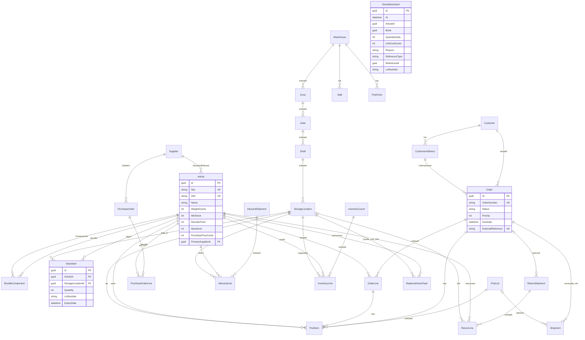

# Datenmodell

Überblick über die Tabellen und ihre Beziehungen. Grundlage ist das EF-Core-Modell in `src/Lager.Infrastructure/Persistence` (`LagerDbContext`, Konfigurationen unter `Configurations/`); die Fachklassen liegen in `src/Lager.Domain`. Architektur und Schema-Änderungen: [ARCHITECTURE.md](ARCHITECTURE.md#schema-evolution), Konfiguration: [CONFIGURATION.md](CONFIGURATION.md).

---

## Inhalt

1. [Grundregeln](#grundregeln)
2. [Beziehungen](#beziehungen)
3. [Tabellen im Überblick](#tabellen-im-überblick)
4. [Bestand und Ledger](#bestand-und-ledger)
5. [Status-Automaten](#status-automaten)
6. [Nummernkreise](#nummernkreise)
7. [Löschen und Fremdschlüssel](#löschen-und-fremdschlüssel)

---

## Grundregeln

- **Primärschlüssel** sind GUIDs. Jede Fachtabelle hat außerdem `CreatedAt`, `UpdatedAt` und `ConcurrencyToken` (siehe unten).
- **Zeitstempel sind UTC.** Die Persistenz liest sie als UTC zurück, deshalb tragen alle JSON-Zeitwerte ein `Z`.
- **Optimistische Sperre:** `ConcurrencyToken` (eine GUID, die bei jeder Änderung wechselt) wird für Bestand (`StockItem`) und die Belege mit Statuswechsel geprüft: Bestellung, Pickliste, Welle, Wareneingang, Inventur, Retoure, Einkaufsbestellung, Sendung, Nachschub-Aufgabe. Ein zweiter, gleichzeitiger Schreiber scheitert mit HTTP 409. Stammdaten tragen die Spalte, erzwingen sie aber nicht.
- **Eindeutigkeit ohne Beachtung der Schreibweise:** SKU, Bestellnummer und Benutzername (unter SQLite mit der Collation `NOCASE`, unter MySQL durch die Standard-Collation).
- **Maße** in Millimetern, **Gewichte** in Gramm, **Preise** in Cent. Positionen im Lager (`Position`) sind eingebettete Werte mit X/Y/Z in Millimetern.
- **Zwei Datenbanken:** SQLite (Standard) und MySQL/MariaDB (Pomelo) mit demselben Modell. MySQL-Schema-Schritte sind nicht gegen einen echten Server getestet, siehe [TROUBLESHOOTING.md](TROUBLESHOOTING.md#mysql).

---

## Beziehungen

Durchgezogene Linien sind Fremdschlüssel. Fachliche Verweise ohne Fremdschlüssel (Ledger, Wellen, Pickwagen-Zuordnung, Detailtabellen) stehen im Text unter dem Diagramm.

**Ohne Fremdschlüssel (fachliche Verweise):**

- `StockMovement` (das Ledger) verweist per `ArticleId`, `BinId` und `ReferenceType`/`ReferenceId` auf Artikel, Lagerplatz und den auslösenden Vorgang, hat aber bewusst keine Fremdschlüssel: die Historie bleibt auch erhalten, wenn ein Lagerplatz gelöscht wird.
- `PickWave` speichert die Bestellungen und Picklisten der Welle als kommagetrennte Id-Listen (`OrderIdsCsv`, `PickListIdsCsv`).
- `PickList.PickCartConfigId` verweist auf `PickCartConfig` (Pickwagen), ohne Fremdschlüssel.
- Detailtabellen (`InboundShipmentLinks`, `InboundLineLinks`, `InventoryLineLots`) hängen 1:1 an Wareneingang, Wareneingangszeile und Inventurzeile (Fremdschlüssel mit Löschweitergabe) und tragen Bestellbezug, Einkaufspreis bzw. Charge und MHD; ihre Verweise auf Bestellung und Bestellzeile sind fachlich, ohne Fremdschlüssel.
- `AuditEntry` und `User` stehen allein; der Audit-Eintrag nennt den Benutzer als Text (Name, `anonymous` oder `system`).

---

## Tabellen im Überblick

| Bereich | Tabellen (Entitäten) | Inhalt |
|---|---|---|
| Stammdaten | `Articles`, `BundleComponents`, `Suppliers`, `Customers`, `CustomerAddresses` | Artikel mit Maßen, Stapelbarkeit, Schwellen, Einkaufspreis, GTIN/EAN (optional, eindeutig), Alternativ-SKUs (CSV-Spalte), Saison-Fenster (gültig ab/bis, das Ende gilt inklusive; die API liefert daraus `isCurrentlyActive`); Bundle-Komponenten; Lieferanten; Kunden mit Adressen |
| Lagerstruktur | `Warehouses`, `Zones`, `Aisles`, `Shelves`, `StorageLocations`, `Walls`, `PickPoints`, `PickCartConfigs` | Lager, Zonen, Gänge, Regale, Lagerplätze (Typ Standard/HotPick/Reserve, Nachschub-Schwelle), Wände als Polylinien, Pickpunkte (Start/Ende), Pickwagen |
| Bestand | `StockItems`, `StockMovements` | Bestandszeilen und das Ledger der Bewegungen |
| Bestellungen | `Orders`, `OrderLines` | Kundenbestellungen (Status, Priorität, Fälligkeit, Kunde, Lieferadresse, externe Referenz) |
| Kommissionieren | `PickLists`, `PickItems`, `PickWaves`, `PickListSequence` | Picklisten mit Route (Wegpunkte als JSON) und Positionen, Wellen, Zähler der Nummernkreise |
| Versand | `Shipments` | Sendungen mit Carrier, Tracking, Maßen, Status |
| Wareneingang und Einkauf | `InboundShipments`, `InboundLines`, `PurchaseOrders`, `PurchaseOrderLines` (+ Detailtabellen `InboundShipmentLinks`, `InboundLineLinks`) | Wareneingänge und Einkaufsbestellungen |
| Inventur und Nachschub | `InventoryCounts`, `InventoryLines` (+ `InventoryLineLots`), `ReplenishmentTasks` | Zählungen und Umlagerungsaufgaben |
| Retouren | `ReturnShipments`, `ReturnLines` | Retouren mit Qualitätsprüfung je Zeile |
| System | `Users`, `AuditEntries`, `__LagerSchemaVersion` | Benutzer, Audit-Trail, angewendete Schema-Schritte |

Das EF-Modell enthält 33 `DbSet`s (Entitäten mit eigenen Tabellen) plus die drei Detailtabellen. `__LagerSchemaVersion` gehört dem `SchemaUpgrader` und steht nicht im EF-Modell.

**Benutzer:** `Users` speichert den BCrypt-Hash (nie das Passwort), die Rollen als Flags (`Viewer`=1, `Picker`=2, `Packer`=4, `Receiver`=8, `Manager`=16, `Admin`=32), Aktiv-Kennzeichen, Fehlversuchszähler, Sperrzeitpunkt und `MustChangePassword`. Benutzer werden nie gelöscht, nur deaktiviert.

**Audit-Trail:** `AuditEntries` hält je Änderung Entitätstyp, Id, Operation (Added/Modified/Deleted), Diff als JSON und den Benutzernamen. Beim Anlegen stehen alle Werte im Diff, beim Ändern nur die geänderten Felder (`old`/`new`), beim Löschen der letzte Stand. Zeitstempel und Sperr-Token fehlen, Passwort-Hashes sind maskiert, die Login-Buchhaltung eines Benutzers (letzter Login, Fehlversuche) erzeugt keinen Eintrag. Auditiert werden **Article, StockItem, Order, PickList, Wall, StorageLocation, Warehouse, PickPoint, Shelf, PickCartConfig und User**. Nicht auditiert sind Kunden, Lieferanten, Einkaufsbestellungen, Wareneingänge, Inventuren, Retouren, Sendungen, Wellen und Nachschub-Aufgaben; für Bestandsänderungen ist das Ledger die Quelle der Wahrheit. Positionszeilen (OrderLine, PickItem ...) erscheinen im Diff ihres Besitzers. Ein **CSV-Import** schreibt statt einer Zeile je Datensatz **einen** Sammel-Eintrag (Entitätstyp CsvImport, Operation Import, Zusammenfassung und Zählungen im Diff).

---

## Bestand und Ledger

**Bestandszeile (`StockItem`):** Bestand ist je **Artikel, Lagerplatz und Charge** eindeutig (Unique-Index `IX_StockItems_ArticleId_StorageLocationId_LotNumber`). Zwei Chargen desselben Artikels im selben Lagerplatz sind zwei Zeilen; dieselbe Charge hat im selben Lagerplatz genau ein MHD (sonst `lot_expiry_mismatch`). Eine leere Charge zählt als "keine Charge" (`NULL`). Leergepickte Zeilen bleiben mit Menge 0 stehen (der Nachschub-Scan braucht sie).

**Ledger (`StockMovement`):** Jede Änderung einer Bestandsmenge schreibt genau einen Eintrag mit **vorzeichenbehaftetem Delta**, Kosten-Snapshot (Cent je Stück), Grund, Verweis auf den Vorgang und Charge/MHD der betroffenen Zeile. Es wird nie geändert oder gelöscht. Ohne diesen Buchungsweg ändert nichts den Bestand. Ausnahme sind nur der veraltete kleine Demo-Datensatz (`Database:Seed`) und die Bulk-Daten: sie legen ihren Bestand ohne Ledger-Einträge an. Der **Demo-Modus** (`Demo:Enabled`) bucht dagegen jeden Bestand über `StockBooking`, sein Ledger stimmt mit dem Bestand überein.

| Grund (`Reason`) | Auslöser |
|---|---|
| `Inbound` | Wareneingang gebucht |
| `Pick` | Pickliste verpackt (der Bestand wird erst beim Packen abgebucht) |
| `Return` | Retoure als Sellable eingebucht |
| `ReturnB`, `ReturnScrap` | B-Ware bzw. Defekt/Vernichtung: Zugang und sofortige Sperre/Ausschuss, netto 0 (kein Verkaufsbestand, aber nachvollziehbar) |
| `Inventory` | Inventur abgeglichen |
| `ReplenishmentOut`, `ReplenishmentIn` | Umlagerung vom Reserve- in den Hot-Pick-Platz |
| `Adjust` | manuelle Bestandskorrektur und CSV-Import des Bestands (Differenz zum Sollwert der Datei) |
| `BinMove` | Verschieben zwischen Lagerplätzen (vorgesehen, noch von keinem Vorgang genutzt) |

Der **Vorgangsverweis** (`ReferenceType`, `ReferenceId`) nennt den auslösenden Beleg, z. B. eine Pickliste beim Verpacken oder einen CSV-Import (Vorgangstyp CsvImport, Vorgangs-Id = Kennung des Imports; Grund `Adjust`).

Es gibt **keine Reservierung**: Kommissionieren "reserviert" nur rechnerisch beim Erzeugen der Pickliste (Allokation) und speichert nichts am Bestand. Gebucht wird beim Verpacken.

Aus dem Ledger werden berechnet: die **Bestandsbewertung** (FIFO über die Zugänge; Umlagerungen sind bewertungsneutral; Menge ohne Ledger-Historie zum aktuellen Stammpreis), der **Bestandsverlauf**, die **Charge-Rückverfolgung** und "Dead-Stock" (letzte Bewegung ohne interne Umlagerungen).

**Auswahl beim Kommissionieren:** Nur nicht abgelaufene Chargen (MHD vor heute UTC gilt als nicht verfügbar), FEFO (frühestes MHD zuerst, Ware ohne MHD zuletzt), dann HotPick vor Standard vor Reserve, dann kleinere Restmenge zuerst. Beim Buchen wählt das Packen die Charge je Lagerplatz erneut nach FEFO.

---

## Status-Automaten

| Objekt | Zustände und Übergänge |
|---|---|
| Bestellung (`Order`) | `New` → `Picking` (Pickliste erzeugt) → `Picked` (Picken abgeschlossen) → `Packed` (verpackt, Bestand gebucht) → `Shipped` (alle Sendungen raus). `Cancelled` aus New, Picking und Picked. Ein Löschen bzw. Stornieren der Pickliste nimmt die Bestellung von Picking/Picked zurück auf `New`. `Shipped` und `Cancelled` sind endgültig. |
| Pickliste (`PickList`) | `Pending` → `Picked` → `Completed` (= verpackt, Bestand gebucht); `InProgress` (Picker zugewiesen) ist vorgesehen, wird aber von keinem Vorgang gesetzt. `Cancelled` aus Pending, InProgress und Picked. `Completed` und `Cancelled` sind endgültig. |
| Welle (`PickWave`) | `Open` → `Released` (Pickliste erzeugt) → `Completed` (alle Picklisten verpackt). `Cancelled` aus Open sowie aus Released, solange keine Liste begonnen wurde. |
| Sendung (`Shipment`) | `Ready` → `Labeled` (Tracking zugewiesen) → `Shipped` → `Delivered`. `Cancelled` nur aus Ready und Labeled. |
| Wareneingang (`InboundShipment`) | `Draft` → `Received` (bucht Bestand) oder `Cancelled`. |
| Einkaufsbestellung (`PurchaseOrder`) | `Draft` → `Sent` → `PartiallyReceived` → `Received`; `Cancelled` bis zum vollständigen Empfang. |
| Inventur (`InventoryCount`) | `Open` → `Reconciled` oder `Cancelled`. |
| Retoure (`ReturnShipment`) | `Draft` → `Processed` oder `Cancelled`. Qualitätsprüfung je Zeile: `Pending`, `Sellable`, `BGrade`, `Defect`, `Destroy`. |
| Nachschub (`ReplenishmentTask`) | `Open` → `Completed` oder `Cancelled`. |

Die Regeln sind in den Domain-Klassen erzwungen (Methoden werfen bei unzulässigen Übergängen), nicht in den Controllern.

---

## Nummernkreise

Fortlaufende Nummern vergibt ein atomarer Zähler in der Tabelle `PickListSequence` (eine Zeile je Kreis; parallele Anfragen bekommen nie dieselbe Nummer, ein abgebrochener Vorgang hinterlässt höchstens eine Lücke).

| Objekt | Format | Beispiel |
|---|---|---|
| Pickliste | `PL-JJJJMMTT-NNNNN` | `PL-20260930-00001` |
| Welle | `W-JJJJMMTT-NNNN` | `W-20260930-0001` |
| Einkaufsbestellung | `PO-JJJJMMTT-NNNNN` | `PO-20260930-00001` |
| Retoure | `RMA-JJJJMMTT-NNNNN` | `RMA-20260930-00001` |
| Sendung | `SH-JJJJMMTT-NNNNN` | `SH-20260930-00001` |
| Wareneingang aus Bestellung | `WE-<Bestellnummer>`, bei Teillieferungen `-2`, `-3` ... | `WE-PO-20260930-00001` |

Bestellnummern, Lieferschein-Nummern (Wareneingang) und Artikelnummern (SKU) vergibt der Benutzer bzw. das Quellsystem. Löscht der Admin alle offenen Picklisten (`DELETE /api/picklists`) und bleibt keine übrig, beginnt der Pickliste-Zähler wieder bei 1.

---

## Löschen und Fremdschlüssel

Fast alle Verweise sind `RESTRICT`: Ein Datensatz, auf den noch Bestand oder Belege zeigen, lässt sich nicht löschen. Die API antwortet dann mit **409** und dem Code `in_use`, statt einen Fehler zu werfen. Beispiele: ein Lagerplatz mit Bestand oder Belegen, ein Lieferant mit Bestellungen, ein Kunde mit Bestellungen. Artikel lassen sich über die API gar nicht löschen (nur ändern); Lieferanten, Kunden und Benutzer werden deaktiviert.

`CASCADE` gilt für echte Bestandteile: Positionen mit ihrem Beleg, Adressen mit ihrem Kunden, Regale mit ihrem Gang usw. `SET NULL`: die Lieferadresse einer Bestellung und die Pickliste einer Sendung.

Bekannte Einschränkung: Tabellen, die der `SchemaUpgrader` in einer Bestandsdatenbank angelegt hat (statt `EnsureCreated` bei einer neuen Datenbank), haben **keine Fremdschlüssel**; das EF-Modell deklariert sie nur für neu angelegte Datenbanken. Die Anwendung prüft die Verweise dann selbst (Services), die Datenbank erzwingt sie nicht.
